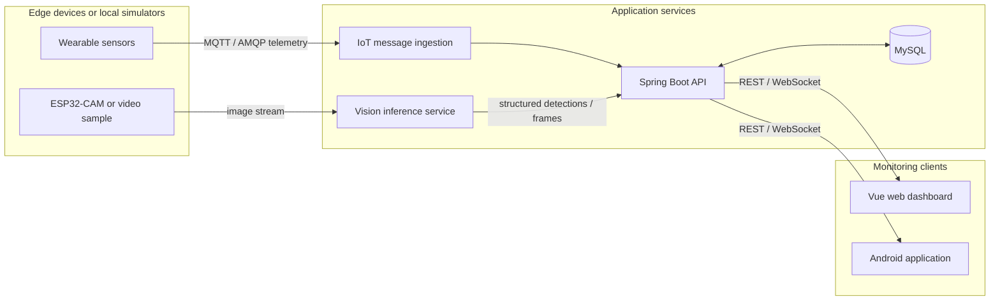

# Smart Helmet AIoT

**A reproducible edge-to-cloud prototype for outdoor safety monitoring and visual perception.**

This portfolio project reconstructs my undergraduate capstone, *Design of an
Outdoor Information Monitoring and Recognition System Based on a Smart Helmet*,
as a research-oriented and reproducible system. The original prototype combined
wearable sensing, cloud messaging, server-side object detection, data storage,
and web and Android clients. This repository is the clean public version: it
contains no production credentials, personal data, or environment-specific
deployment configuration.

> **Current status:** portfolio reconstruction in progress. The architecture and
> implemented prototype are documented below. Source modules will be migrated
> only after they are made reproducible, tested, and safe to publish.

## Research motivation

Outdoor monitoring systems must process heterogeneous sensor and camera data
over networks whose latency and reliability can change rapidly. A useful system
therefore needs more than a working interface: it must expose the trade-offs
between sensing rate, inference frequency, network quality, and response time.

This project asks:

> How do frame-sampling frequency and network conditions affect the latency,
> throughput, reliability, and detection utility of a resource-constrained
> edge-to-cloud monitoring pipeline?

The reconstruction is designed to turn the original engineering prototype into
an experimental platform for studying that question.

## System overview



The public evaluation path will support simulators and fixed video inputs so
that the complete pipeline can be reproduced without physical hardware or a
commercial cloud account.

## Prototype capabilities

The working-directory audit found the following implemented components in the
graduation prototype:

| Component | Verified implementation | Public reconstruction status |
|---|---|---|
| Telemetry ingestion | Huawei Cloud IoTDA integration through AMQP and device-shadow polling | Configuration and ingestion logic must be migrated |
| Application backend | Java 17, Spring Boot 3, MyBatis, MySQL, REST endpoints | Clean API module planned |
| Sensor state storage | Insert/update logic for per-device status records | Portable schema and migrations planned |
| Web client | Vue 3, Vite, Element Plus, ECharts, REST and WebSocket integration | UI migration planned |
| Android client | Sensor display, navigation, video/WebSocket integration | API boundary and configuration need refactoring |
| Vision display | Browser client receives JPEG frames over WebSocket | Inference service source and benchmark path need reconstruction |

The prototype data model includes helmet-wear status, body and ambient
temperature, ambient humidity, heart rate, location, blood pressure, impact or
body pressure, and movement speed.

## My contribution

- Designed the end-to-end data path from sensing and camera nodes to cloud
  services and monitoring clients.
- Implemented the Spring Boot and MyBatis application backend for device,
  status, and user data.
- Integrated cloud IoT messages and device-shadow data into the application
  pipeline.
- Developed web and Android interfaces for telemetry and visual monitoring.
- Integrated the client-side path for receiving real-time detection frames.
- Defined the portfolio reconstruction and evaluation plan for latency,
  throughput, and reliability experiments.

## Evaluation plan

The public version will report measurements rather than only screenshots or
feature demonstrations.

| Experiment | Controlled variables | Reported metrics |
|---|---|---|
| Vision performance | model, input resolution, frame-sampling interval | throughput, mean latency, p95 latency |
| Network robustness | added delay, packet loss, disconnection duration | delivery rate, reconnect time, missing samples |
| Accuracy–latency trade-off | inference frequency and model size | detection metric, FPS, end-to-end latency |

Every published figure will be accompanied by its experiment configuration,
raw anonymised results, and plotting script. No numerical claims will be added
until the corresponding experiment can be reproduced from this repository.

## Repository structure

```text
smart-helmet-aiot/
├── android/            # Android monitoring client
├── backend/            # Telemetry ingestion and application API
├── dashboard/          # Vue monitoring dashboard
├── data/               # Small, non-sensitive sample inputs
├── docs/               # Architecture, decisions, limitations, and demo
├── experiments/        # Benchmarks, raw results, and plots
├── firmware/           # Optional ESP8266 and ESP32-CAM integration
├── simulator/          # Hardware-independent telemetry and network simulation
└── vision-service/     # Reproducible object-detection service
```

## Reproduction target

The intended local workflow is:

```bash
git clone https://github.com/Kettkk/smart-helmet-aiot.git
cd smart-helmet-aiot
cp .env.example .env
docker compose up --build
```

These commands describe the target interface and will be marked ready only
after the Docker Compose pipeline and sample inputs are committed. Until then,
the repository should be treated as an actively reconstructed research artifact.

## Roadmap

- [x] Create a credential-free public repository and research framing
- [x] Document the architecture, verified prototype scope, and limitations
- [ ] Migrate and refactor the Spring Boot backend
- [ ] Add a portable database schema and synthetic telemetry generator
- [ ] Add a locally reproducible vision service and fixed video sample
- [ ] Connect the web dashboard to the local API and WebSocket endpoints
- [ ] Package the minimal pipeline with Docker Compose
- [ ] Add automated tests and continuous integration
- [ ] Run latency, throughput, and network-reliability experiments
- [ ] Publish an anonymised dataset, plots, and a short technical report

## Limitations

- The original prototype depended on physical devices and managed cloud
  services, so it was not independently reproducible.
- The inspected client code contains environment-specific endpoints that will
  be replaced with runtime configuration during migration.
- The original Android prototype accesses application data too directly; the
  reconstruction will place a documented API between clients and storage.
- The vision pipeline needs a versioned model, evaluation dataset, and benchmark
  script before detection-performance claims can be reported.
- This is a research prototype, not a certified medical or personal-safety
  device.

## Security and privacy

Secrets are supplied through local environment variables and are excluded from
version control. Public samples must be synthetic or anonymised, particularly
for location and physiological measurements. See [SECURITY.md](SECURITY.md) for
the disclosure policy and [.env.example](.env.example) for safe configuration.

## Technology stack

Java 17 · Spring Boot 3 · MyBatis · MySQL · MQTT/AMQP · Huawei Cloud IoTDA ·
Vue 3 · Vite · Element Plus · ECharts · Android · WebSocket · YOLO-based visual
perception

## Academic context

This repository is being prepared as a research portfolio for internships and
future graduate study in edge AI, reliable AIoT systems, embedded visual
perception, and edge–cloud computing. The emphasis is on reproducibility,
measured system behaviour, explicit limitations, and research questions that
can be tested rather than on presenting the prototype as a finished product.
