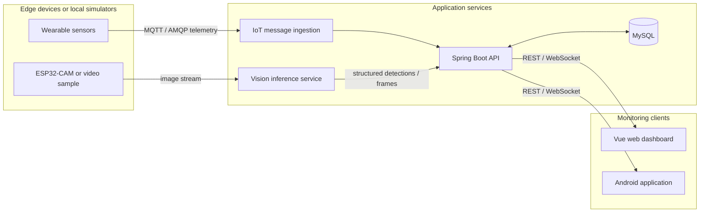

# Smart Helmet AIoT

**A reproducible edge-to-cloud prototype for outdoor safety monitoring and visual perception.**

## System demo

[](docs/demo.mp4)

The 39-second demo shows live simulated telemetry flowing through the local
MQTT, Spring Boot, MySQL, and Vue stack; the measured frame-sampling benchmark;
and YOLO inference on a fixed outdoor video. Select the image to open the
higher-quality MP4 version.

This portfolio project reconstructs my undergraduate capstone, *Design of an
Outdoor Information Monitoring and Recognition System Based on a Smart Helmet*,
as a research-oriented and reproducible system. The original prototype combined
wearable sensing, cloud messaging, server-side object detection, data storage,
and web and Android clients. This repository is the clean public version: it
contains no production credentials, personal data, or environment-specific
deployment configuration.

> **Current status:** the credential-free telemetry and fixed-video loops are ready.
> A deterministic simulator publishes MQTT telemetry, the Spring Boot service
> validates and stores it in MySQL, and a REST API exposes latest and historical
> samples. A live Vue dashboard visualises the resulting state and the measured
> vision benchmark. A reproducible
> YOLO batch pipeline now processes a licensed 20-second hiking sample and emits
> an annotated video, structured detections, and latency/FPS measurements. A
> separate MQTT benchmark measures delay, controlled loss, and recovery from
> real broker outages. The mobile client remains reconstruction work.

## Research motivation

Outdoor monitoring systems must process heterogeneous sensor and camera data
over networks whose latency and reliability can change rapidly. A useful system
therefore needs more than a working interface: it must expose the trade-offs
between sensing rate, inference frequency, network quality, and response time.

This project asks:

> How do frame-sampling frequency and network conditions affect the latency,
> throughput, reliability, and detection utility of a resource-constrained
> edge-to-cloud monitoring pipeline?

The reconstruction is designed to turn the original engineering prototype into
an experimental platform for studying that question.

## System overview




The public evaluation path will support simulators and fixed video inputs so
that the complete pipeline can be reproduced without physical hardware or a
commercial cloud account.

## Prototype capabilities

The working-directory audit found the following implemented components in the
graduation prototype:

| Component | Verified implementation | Public reconstruction status |
|---|---|---|
| Telemetry ingestion | Huawei Cloud IoTDA integration through AMQP and device-shadow polling | Local MQTT consumer and synthetic publisher implemented |
| Application backend | Java 17, Spring Boot 3, MyBatis, MySQL, REST endpoints | Clean Spring Boot REST API implemented |
| Sensor state storage | Insert/update logic for per-device status records | MySQL schema and Flyway migration implemented |
| Web client | Vue 3, Vite, Element Plus, ECharts, REST and WebSocket integration | Live Vue dashboard connected to the local REST API |
| Android client | Sensor display, navigation, video/WebSocket integration | API boundary and configuration need refactoring |
| Vision display | Browser client receives JPEG frames over WebSocket | Fixed-video YOLO inference and benchmark artifacts implemented |

The prototype data model includes helmet-wear status, body and ambient
temperature, ambient humidity, heart rate, location, blood pressure, impact or
body pressure, and movement speed.

## My contribution

- Designed the end-to-end data path from sensing and camera nodes to cloud
  services and monitoring clients.
- Implemented the Spring Boot and MyBatis application backend for device,
  status, and user data.
- Integrated cloud IoT messages and device-shadow data into the application
  pipeline.
- Developed web and Android interfaces for telemetry and visual monitoring.
- Integrated the client-side path for receiving real-time detection frames.
- Defined the portfolio reconstruction and evaluation plan for latency,
  throughput, and reliability experiments.

## Evaluation

The public version reports measurements rather than only screenshots or feature
demonstrations.

| Experiment | Controlled variables | Reported metrics |
|---|---|---|
| Vision performance | model, input resolution, frame-sampling interval | throughput, mean latency, p95 latency |
| Network robustness | added delay, packet loss, disconnection duration | delivery rate, reconnect time, missing samples |
| Accuracy–latency trade-off | inference frequency and model size | detection metric, FPS, end-to-end latency |

Every published figure is accompanied by its experiment configuration, raw
anonymised results, and plotting script.

### Measured frame-sampling result

The fixed 20-second video was evaluated with strides 1, 2, 5, and 10 in the
same CPU-only Docker environment. Per-inference latency remained near 106–109
ms, while reducing inference frequency increased whole-pipeline throughput.
Stride 5 was the highest tested sampling frequency that processed the 30 fps
source faster than real time on the measured machine.


These are system measurements on one unlabelled clip, not model-accuracy
claims. See [docs/vision-demo.md](docs/vision-demo.md) for all four figures,
the experiment environment, limitations, and links to raw results.

### Measured network-reliability result

The MQTT benchmark evaluated five added-delay levels, six controlled-loss
levels, and 1/3/5-second broker outages. Every condition was repeated three
times with QoS 1 and a fixed random seed. Mean latency rose from 2.743 ms at the
local baseline to 207.906 ms with 200 ms added delay. All published messages
were delivered; the end-to-end delivery rate declined according to the seeded
pre-publish impairment. After broker restart, reconnect plus subscription
recovery averaged 776–794 ms, and all nine recovery probes were delivered.


See [docs/network-reliability.md](docs/network-reliability.md) for the full
method, latency figure, observed tables, raw CSV links, and limitations. The
loss model is deliberately described as an application-layer impairment, not a
claim about physical wireless packet loss.

## Repository structure

```text
smart-helmet-aiot/
├── android/            # Android monitoring client
├── backend/            # Telemetry ingestion and application API
├── dashboard/          # Vue monitoring dashboard
├── data/               # Small, non-sensitive sample inputs
├── docs/               # Architecture, decisions, limitations, and demo
├── experiments/        # Benchmarks, raw results, and plots
├── firmware/           # Optional ESP8266 and ESP32-CAM integration
├── infrastructure/     # Local broker configuration
├── scripts/            # Repeatable smoke-test commands
├── simulator/          # Hardware-independent telemetry and network simulation
├── vision-service/     # Reproducible object-detection service
└── compose.yaml        # Local end-to-end environment
```

## Run the local closed loop

Prerequisites: Docker Desktop with its engine running, Docker Compose v2, and
`curl`. No helmet hardware or cloud account is required.

```bash
git clone https://github.com/Kettkk/smart-helmet-aiot.git
cd smart-helmet-aiot
cp .env.example .env
docker compose up --build -d
./scripts/smoke-test.sh
```

Open the live dashboard at [http://localhost:3000](http://localhost:3000). It
updates every two seconds and displays the latest measurements, a 30-sample
trend, the observed pipeline state, synthetic coordinates, and recent records.

The simulator publishes one synthetic record per second. Inspect the latest
sample with:

```bash
curl http://localhost:8080/api/v1/devices/helmet-sim-001/latest
```

Stop the services without deleting the persisted MySQL volume:

```bash
docker compose down
```

See [docs/local-closed-loop.md](docs/local-closed-loop.md) for the message
contract, endpoints, troubleshooting, and acceptance criteria. The observed
results from the first full local run are recorded in
[docs/validation-report.md](docs/validation-report.md).

Dashboard behavior and display thresholds are documented in
[docs/dashboard.md](docs/dashboard.md).

Run the fixed-video detection path independently:

```bash
./scripts/run-vision-demo.sh
```

Run the controlled frame-sampling benchmark and regenerate its figures:

```bash
./scripts/run-vision-benchmark.sh
./scripts/plot-vision-results.sh
```

It writes an annotated video, frame-level JSONL/CSV records, and a measured
summary to `experiments/results/vision-demo/`. See
[vision-service/README.md](vision-service/README.md) for the command and
[docs/vision-demo.md](docs/vision-demo.md) for the measured baseline and its
interpretation.

Run the isolated MQTT reliability benchmark and regenerate all network figures:

```bash
./scripts/run-network-experiments.sh
```

This starts a temporary Mosquitto container on port `18883`; it does not stop
the normal local stack. See
[docs/network-reliability.md](docs/network-reliability.md) for the experimental
protocol and interpretation.

## Local API

| Method | Endpoint | Purpose |
|---|---|---|
| `GET` | `/actuator/health` | Service and database health |
| `GET` | `/api/v1/devices` | Known devices and last-seen times |
| `GET` | `/api/v1/devices/{deviceId}/latest` | Latest validated record |
| `GET` | `/api/v1/devices/{deviceId}/telemetry?limit=100` | Newest records, maximum 500 |

## Roadmap

- [x] Create a credential-free public repository and research framing
- [x] Document the architecture, verified prototype scope, and limitations
- [x] Migrate and refactor the Spring Boot backend
- [x] Add a portable database schema and synthetic telemetry generator
- [x] Add a locally reproducible vision service and fixed video sample
- [x] Connect the web dashboard to the local REST API
- [x] Package the telemetry pipeline and dashboard with Docker Compose
- [ ] Add WebSocket push updates
- [x] Add backend integration tests and continuous integration
- [x] Run latency, throughput, and network-reliability experiments
- [ ] Publish an anonymised dataset, plots, and a short technical report

## Limitations

- The original prototype depended on physical devices and managed cloud
  services, so it was not independently reproducible.
- The inspected client code contains environment-specific endpoints that will
  be replaced with runtime configuration during migration.
- The original Android prototype accesses application data too directly; the
  reconstruction will place a documented API between clients and storage.
- The vision sample has no ground-truth labels. It supports system-performance
  measurements and qualitative inspection, but not precision, recall, or mAP
  claims; a versioned evaluation dataset is still required for those metrics.
- This is a research prototype, not a certified medical or personal-safety
  device.

## Security and privacy

Secrets are supplied through local environment variables and are excluded from
version control. Public samples must be synthetic or anonymised, particularly
for location and physiological measurements. See [SECURITY.md](SECURITY.md) for
the disclosure policy and [.env.example](.env.example) for safe configuration.

## Technology stack

Java 17 · Spring Boot 3 · Spring Data JPA · Flyway · MySQL · MQTT/AMQP · Huawei Cloud IoTDA ·
Vue 3 · Vite · ECharts · Nginx · Android · WebSocket · YOLO-based visual
perception

## Academic context

This repository is being prepared as a research portfolio for internships and
future graduate study in edge AI, reliable AIoT systems, embedded visual
perception, and edge–cloud computing. The emphasis is on reproducibility,
measured system behaviour, explicit limitations, and research questions that
can be tested rather than on presenting the prototype as a finished product.
