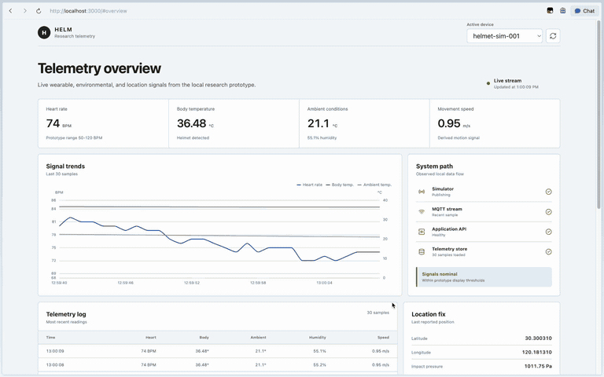
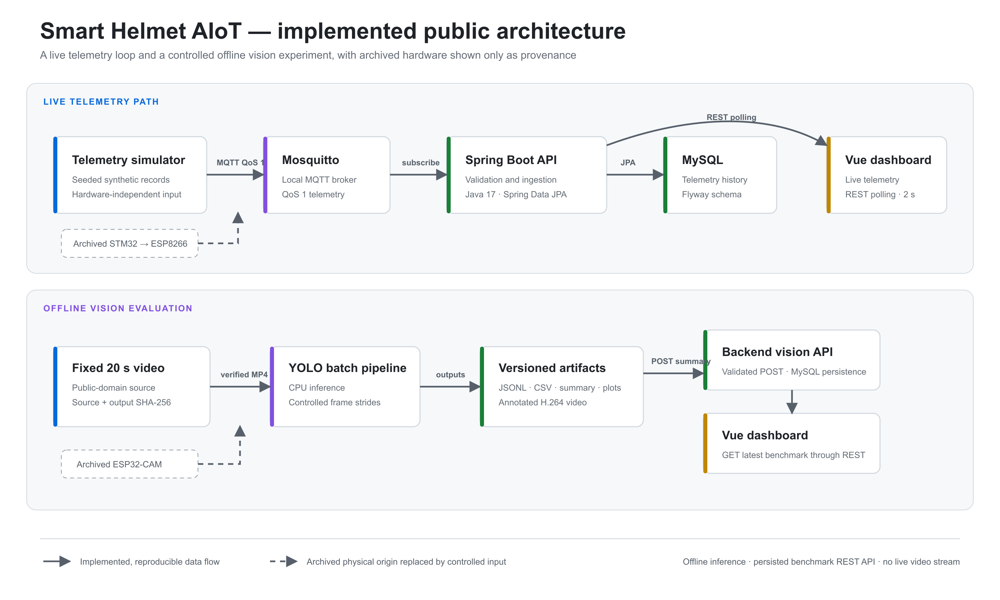
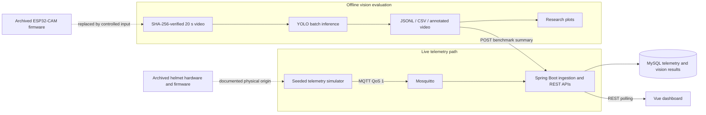
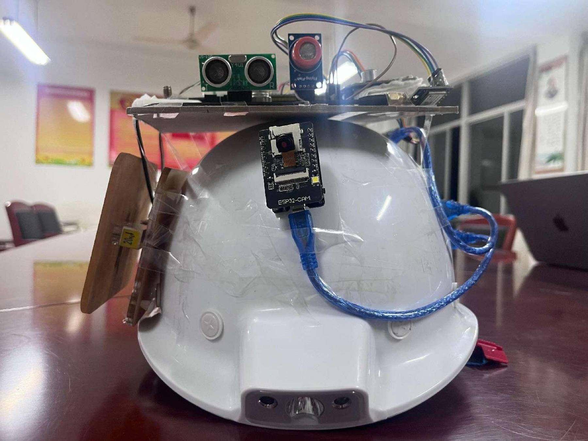
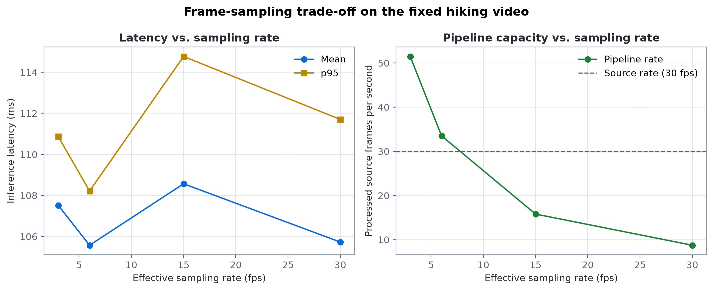
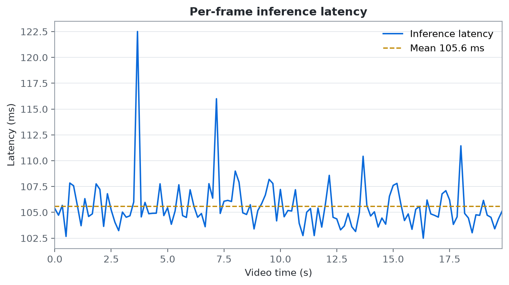
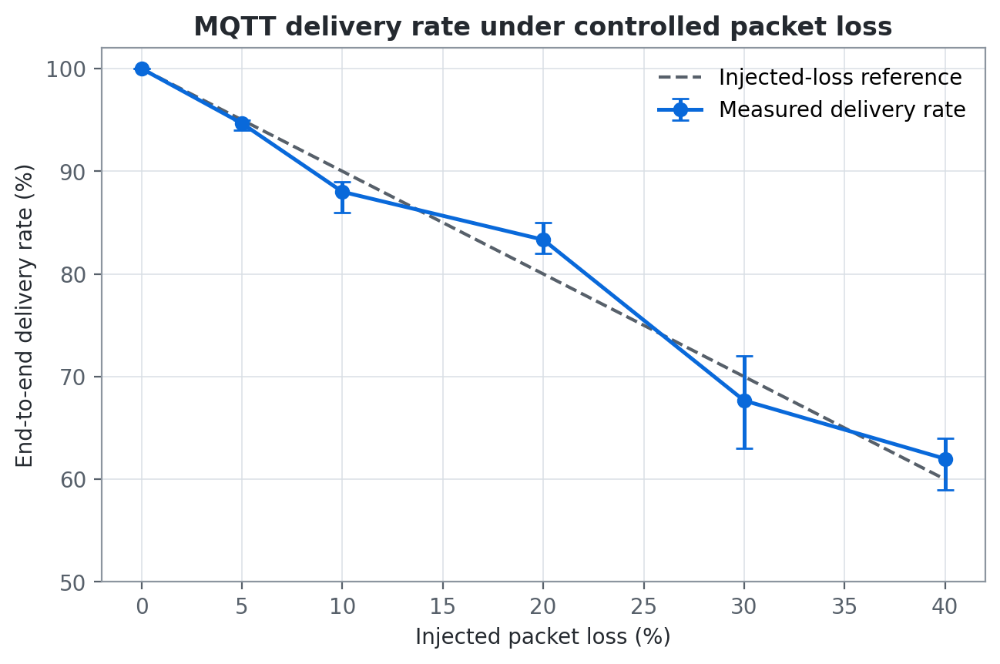
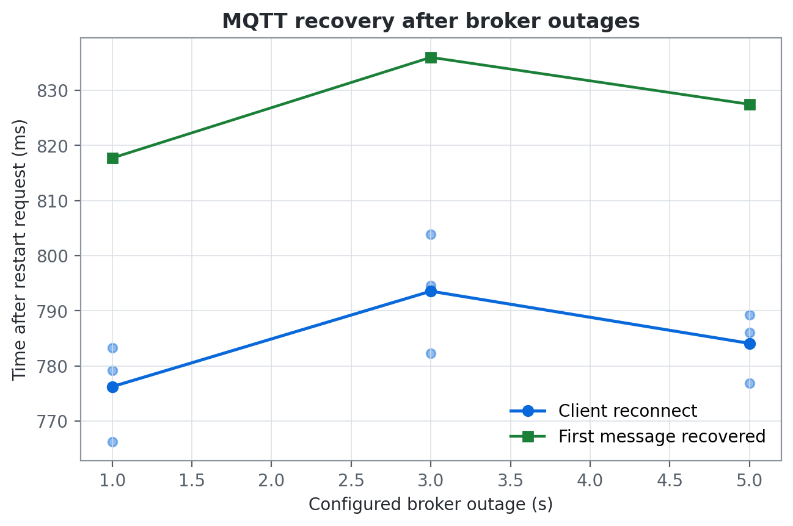

# Smart Helmet AIoT

**A reproducible edge-to-cloud prototype for outdoor safety monitoring and visual perception.**

[Project homepage](https://kettkk.github.io/smart-helmet-aiot/) ·
[Technical report (PDF)](output/pdf/smart-helmet-aiot-technical-report.pdf) ·
[Report source](docs/technical-report.md) ·
[Reproducibility guide](docs/local-closed-loop.md)

## 30-second research summary

**Research question.** How do frame-sampling frequency and network conditions
affect latency, throughput, reliability, and detection continuity in a
resource-constrained edge-to-cloud monitoring pipeline?

**What I built.** A reproducible system that connects seeded MQTT telemetry and
fixed-video YOLO inference to a Spring Boot API, MySQL storage, and a live Vue
dashboard, with archived ESP8266 and ESP32-CAM firmware documenting the physical
helmet prototype.

**Three measured results.**

| Experiment | Measured result |
|---|---|
| Frame sampling | Stride 5 sustained 34.56 pipeline FPS with 99.17% sampled-frame detection continuity; continuity is not model accuracy. |
| Added publication delay | Mean observed latency increased from 2.74 ms at baseline to 207.91 ms with 200 ms of application-added delay. |
| Broker outage recovery | All 9 outage trials recovered; subscription recovery averaged approximately 0.78 seconds after broker availability. |

**My contribution.** I designed the public architecture; implemented the
ESP8266 bridge and ESP32-CAM integration, backend, dashboard, simulators, and
experiments; and documented the contribution boundary. The upstream STM32
sensor firmware was developed by another contributor.

**Review paths.** [Watch the demo](#system-demo) ·
[Read the report](output/pdf/smart-helmet-aiot-technical-report.pdf) ·
[Reproduce the closed loop](#run-the-local-closed-loop)

## System demo

[](docs/demo.mp4)

The 39-second demo shows live simulated telemetry flowing through the local
MQTT, Spring Boot, MySQL, and Vue stack; the measured frame-sampling benchmark;
and YOLO inference on a fixed outdoor video. Select the image to open the
higher-quality MP4 version.

This portfolio project reconstructs my undergraduate capstone, *Design of an
Outdoor Information Monitoring and Recognition System Based on a Smart Helmet*,
as a research-oriented and reproducible system. The original prototype combined
wearable sensing, cloud messaging, server-side object detection, data storage,
and web and Android clients. This repository is the clean public version: it
contains no production credentials or environment-specific deployment
configuration. Prototype photographs are published with the participants'
permission.

## Research motivation

Outdoor monitoring systems must process heterogeneous sensor and camera data
over networks whose latency and reliability can change rapidly. A useful system
therefore needs more than a working interface: it must expose the trade-offs
between sensing rate, inference frequency, network quality, and response time.

This project asks:

> How do frame-sampling frequency and network conditions affect the latency,
> throughput, reliability, and detection continuity of a resource-constrained
> edge-to-cloud monitoring pipeline?

This is the project's complete research scope. It measures latency, throughput,
detection continuity, and transport reliability; it does not investigate model
accuracy, medical validity, energy optimisation, or edge–cloud offloading.

## System overview





The two solid paths above are implemented and reproducible without physical
hardware or a commercial cloud account. The vision experiment remains an
offline batch process, but its structured benchmark summary is now validated,
stored, and served by Spring Boot rather than bundled into the frontend. The
repository does not claim live video-frame delivery or a vision WebSocket. The
archived hardware records research provenance rather than a runtime dependency.

## Physical wearable prototype



The original proof of concept integrated an AI-Thinker ESP32-CAM, an ESP8266
telemetry bridge, positioning hardware, and multiple sensor inputs on a wearable
helmet. The ESP8266 received a 31-byte UART frame from an STM32 acquisition
board and reported selected measurements to Huawei Cloud IoTDA; the ESP32-CAM
provided a separate Wi-Fi image stream. The STM32 firmware was developed
outside my contribution and is not included or claimed here.

See [the physical prototype record](docs/hardware-prototype.md) for front and
rear hardware views, an outdoor field-test photograph, the data path,
contribution boundaries, and limitations. Inspect the archived, configurable
firmware in [`firmware/`](firmware/).

## Prototype capabilities

<details>
<summary><strong>View implementation coverage and reconstruction status</strong></summary>

The working-directory audit found the following implemented components in the
graduation prototype:

| Component | Verified implementation | Public reconstruction status |
|---|---|---|
| Wearable telemetry node | STM32 sensor frame connected to an ESP8266 UART-to-MQTT bridge | Archived ESP8266 source and configuration template published |
| Camera node | AI-Thinker ESP32-CAM with HTTP capture and MJPEG streaming | Archived camera-node source and prototype photographs published |
| Telemetry ingestion | Huawei Cloud IoTDA integration through AMQP and device-shadow polling | Local MQTT consumer and synthetic publisher implemented |
| Application backend | Java 17, Spring Boot 3, MyBatis, MySQL, REST endpoints | Clean Spring Boot REST API implemented |
| Sensor state storage | Insert/update logic for per-device status records | MySQL schema and Flyway migration implemented |
| Web client | Vue 3, Vite, Element Plus, ECharts, REST and WebSocket integration | Live Vue dashboard connected to the local REST API |
| Android client | Sensor display, navigation, video/WebSocket integration | Historical boundary; excluded from the tested public stack |
| Vision display | Browser client receives JPEG frames over WebSocket | Fixed-video benchmark is persisted by Spring Boot and displayed through REST |

The prototype data model includes helmet-wear status, body and ambient
temperature, ambient humidity, heart rate, location, blood pressure, impact or
body pressure, and movement speed.

</details>

## My contribution

- Designed the end-to-end data path from sensing and camera nodes to cloud
  services and monitoring clients.
- Implemented the ESP8266 boundary that parses the STM32 UART frame and reports
  service properties to Huawei Cloud IoTDA. The upstream STM32 firmware was not
  my work.
- Integrated and configured the ESP32-CAM image-streaming node using the
  Espressif CameraWebServer foundation.
- Implemented the Spring Boot and MyBatis application backend for device,
  status, and user data.
- Integrated cloud IoT messages and device-shadow data into the application
  pipeline.
- Developed web and Android interfaces for telemetry and visual monitoring.
- Integrated the historical prototype's client-side path for receiving
  real-time detection frames; the public reconstruction uses versioned batch
  results instead.
- Defined the portfolio reconstruction and evaluation plan for latency,
  throughput, and reliability experiments.

## Evaluation

The public version reports measurements rather than only screenshots or feature
demonstrations.

| Experiment | Controlled variables | Reported metrics |
|---|---|---|
| Vision performance | frame-sampling interval; fixed model and resolution | throughput, mean latency, p95 latency |
| Network robustness | added delay, packet loss, disconnection duration | delivery rate, reconnect time, missing samples |
| Sampling–continuity trade-off | inference frequency | sampled-frame continuity rate, FPS, end-to-end latency |

Every published figure is accompanied by its experiment configuration, raw
anonymised results, and plotting script.

### Measured frame-sampling result

The SHA-256-pinned 20-second video was evaluated with strides 1, 2, 5, and 10
in the same CPU-only Docker environment. Mean latency was 108–110 ms for
strides 2–10; the stride-1 run showed heavier tail latency (317 ms p95).
Reducing inference frequency increased whole-pipeline throughput, and stride 5
was the highest tested sampling frequency that processed the 30 fps source
faster than real time on the measured machine.





These are system measurements on one unlabelled clip, not model-accuracy
claims. See [docs/vision-demo.md](docs/vision-demo.md) for all four figures,
the experiment environment, limitations, and links to raw results.

### Measured network-reliability result

The MQTT benchmark evaluated five added-delay levels, six controlled-loss
levels, and 1/3/5-second broker outages. Every condition was repeated three
times with QoS 1 and a fixed random seed. Mean latency rose from 2.743 ms at the
local baseline to 207.906 ms with 200 ms added delay. All published messages
were delivered; the end-to-end delivery rate declined according to the seeded
pre-publish impairment. After broker restart, reconnect plus subscription
recovery averaged 776–794 ms, and all nine recovery probes were delivered.





See [docs/network-reliability.md](docs/network-reliability.md) for the full
method, latency figure, observed tables, raw CSV links, and limitations. The
loss model is deliberately described as an application-layer impairment, not a
claim about physical wireless packet loss.

## Repository structure

```text
smart-helmet-aiot/
├── android/            # Historical Android boundary and reconstruction notes
├── backend/            # Telemetry ingestion and vision benchmark REST APIs
├── dashboard/          # Vue monitoring dashboard
├── data/               # Small, non-sensitive sample inputs
├── docs/               # Architecture, decisions, limitations, and demo
├── experiments/        # Benchmarks, raw results, and plots
├── firmware/           # Archived ESP8266 and ESP32-CAM integrations
├── infrastructure/     # Local broker configuration
├── scripts/            # Repeatable smoke-test commands
├── simulator/          # Deterministic hardware-independent telemetry publisher
├── vision-service/     # Reproducible object-detection service
└── compose.yaml        # Local end-to-end environment
```

## Run the local closed loop

Prerequisites: Docker Desktop with its engine running, Docker Compose v2, and
`curl`. No helmet hardware or cloud account is required.

```bash
git clone https://github.com/Kettkk/smart-helmet-aiot.git
cd smart-helmet-aiot
cp .env.example .env
docker compose up --build -d
./scripts/smoke-test.sh
```

Open the live dashboard at [http://localhost:3000](http://localhost:3000). It
updates every two seconds and displays the latest measurements, a 30-sample
trend, the observed pipeline state, synthetic coordinates, and recent records.

The simulator publishes one synthetic record per second. Inspect the latest
sample with:

```bash
curl http://localhost:8080/api/v1/devices/helmet-sim-001/latest
```

Stop the services without deleting the persisted MySQL volume:

```bash
docker compose down
```

See [docs/local-closed-loop.md](docs/local-closed-loop.md) for the message
contract, endpoints, troubleshooting, and acceptance criteria. The observed
results from the first full local run are recorded in
[docs/validation-report.md](docs/validation-report.md).

Dashboard behavior and display thresholds are documented in
[docs/dashboard.md](docs/dashboard.md).

Run the fixed-video detection path independently:

```bash
./scripts/run-vision-demo.sh
```

The command automatically downloads the public-domain reference clip and
verifies SHA-256 digests before running inference. FFmpeg, `curl`, and Python 3
are required for first-time sample preparation.

Run the controlled frame-sampling benchmark and regenerate its figures:

```bash
./scripts/run-vision-benchmark.sh
./scripts/plot-vision-results.sh
```

With the local Compose stack running, the benchmark command automatically
publishes its validated summary to Spring Boot. Set
`VISION_PUBLISH_RESULTS=false` only when intentionally generating artifacts
without a backend. To republish existing results, run:

```bash
./scripts/publish-vision-results.sh
```

It writes an annotated video, frame-level JSONL/CSV records, and a measured
summary to `experiments/results/vision-demo/`. See
[vision-service/README.md](vision-service/README.md) for the command and
[docs/vision-demo.md](docs/vision-demo.md) for the measured baseline and its
interpretation.

Run the isolated MQTT reliability benchmark and regenerate all network figures:

```bash
./scripts/run-network-experiments.sh
```

This starts a temporary Mosquitto container on port `18883`; it does not stop
the normal local stack. See
[docs/network-reliability.md](docs/network-reliability.md) for the experimental
protocol and interpretation.

## Local API

<details>
<summary><strong>View REST endpoints</strong></summary>

| Method | Endpoint | Purpose |
|---|---|---|
| `GET` | `/actuator/health` | Service and database health |
| `GET` | `/api/v1/devices` | Known devices and last-seen times |
| `GET` | `/api/v1/devices/{deviceId}/latest` | Latest validated record |
| `GET` | `/api/v1/devices/{deviceId}/telemetry?limit=100` | Newest records, maximum 500 |
| `POST` | `/api/v1/vision/benchmarks` | Validate and persist a measured vision benchmark |
| `GET` | `/api/v1/vision/benchmarks/latest` | Latest benchmark and per-stride runs |

</details>

## Roadmap

- [x] Create a credential-free public repository and research framing
- [x] Document the architecture, verified prototype scope, and limitations
- [x] Publish physical-prototype evidence and attributed firmware
- [x] Migrate and refactor the Spring Boot backend
- [x] Add a portable database schema and synthetic telemetry generator
- [x] Add a locally reproducible vision service and a hash-verified video sample
- [x] Connect the web dashboard to the local REST API
- [x] Persist vision benchmark results in the backend and serve them to the dashboard
- [x] Package the telemetry pipeline and dashboard with Docker Compose
- [ ] Add WebSocket push updates
- [x] Add backend integration tests and continuous integration
- [x] Run latency, throughput, and network-reliability experiments
- [x] Publish synthetic/raw benchmark data and reproducible plots
- [x] Publish a short technical report

## Limitations

- The original prototype depended on physical devices and managed cloud
  services, so it was not independently reproducible.
- The STM32 acquisition firmware was developed outside this portfolio and is
  not included. The public ESP8266 code documents the UART boundary rather than
  claiming the complete sensor acquisition stack.
- The Android client is retained only as a documented historical boundary and
  is not part of the reproducible Compose stack.
- The vision sample has no ground-truth labels. It supports system-performance
  measurements and qualitative inspection, but not precision, recall, or mAP
  claims; a versioned evaluation dataset is still required for those metrics.
- This is a research prototype, not a certified medical or personal-safety
  device.

## Security and privacy

Secrets are supplied through local configuration files or environment variables
and are excluded from version control. Public samples must be synthetic or
anonymised, particularly for location and physiological measurements. The
prototype photographs are included with permission from the people shown. See
[SECURITY.md](SECURITY.md) for the disclosure policy and
[.env.example](.env.example) for safe configuration.

## Technology stack

Java 17 · Spring Boot 3 · Spring Data JPA · Flyway · MySQL · MQTT · Mosquitto ·
Vue 3 · Vite · ECharts · Nginx · Docker Compose · YOLO-based visual perception

## License

Original code and documentation in this repository are licensed under the
[Apache License 2.0](LICENSE). Third-party components and media retain their
own notices: the ESP32-CAM archive preserves Espressif attribution, and the
fixed research video is a public-domain U.S. federal government work documented
in [data/samples/README.md](data/samples/README.md).

## Academic context

This repository is being prepared as a research portfolio for internships and
future graduate study in edge AI, reliable AIoT systems, embedded visual
perception, and edge–cloud computing. The emphasis is on reproducibility,
measured system behaviour, explicit limitations, and research questions that
can be tested rather than on presenting the prototype as a finished product.
