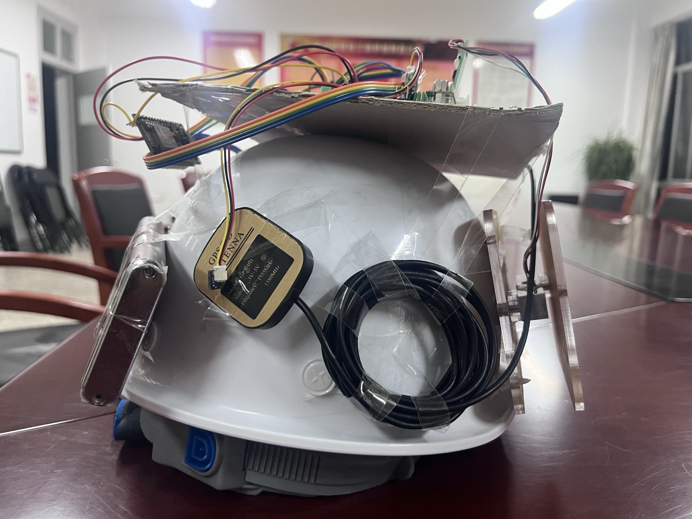
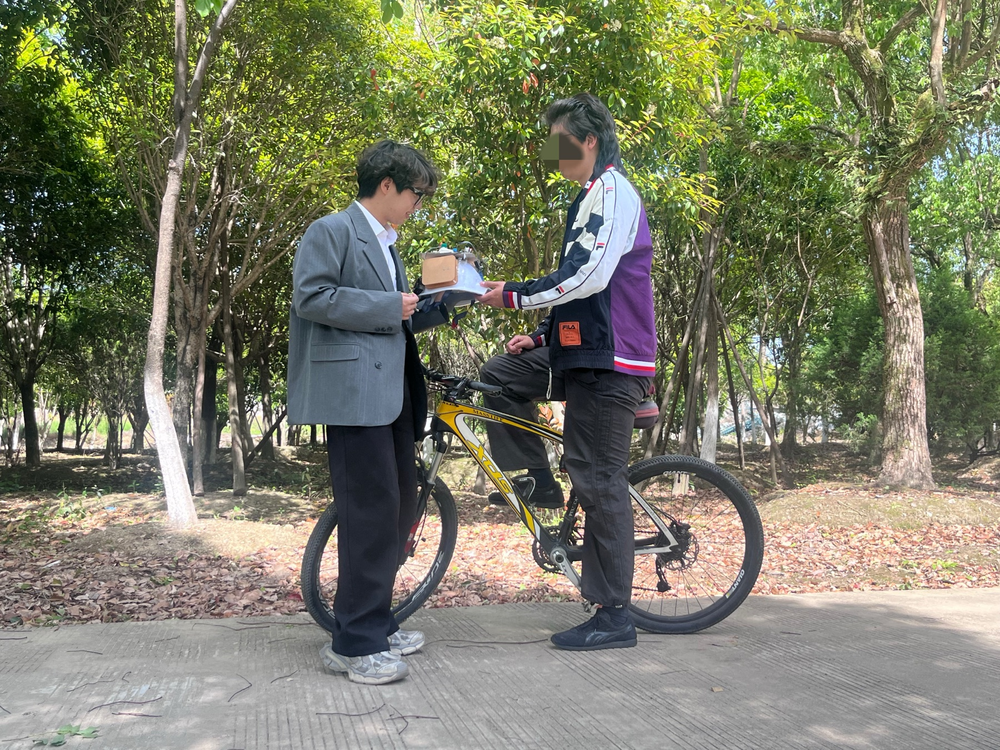
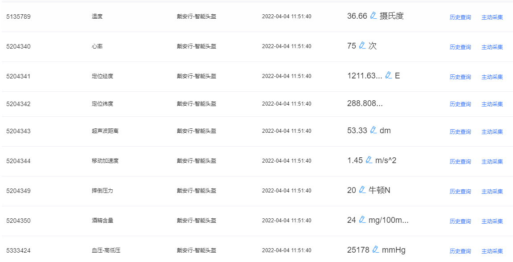
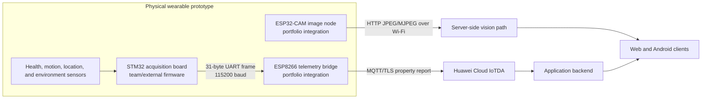

# Physical smart-helmet prototype

The reproducible Docker system in this repository is a reconstruction of a
physical wearable prototype. This page records the hardware evidence and the
boundary between work represented in this portfolio and work supplied by other
members of the original project.

## Prototype evidence

### Integrated front view

The front-mounted AI-Thinker ESP32-CAM supplied JPEG frames over Wi-Fi. The
upper carrier held environmental and proximity modules used during prototype
integration. This is an engineering proof of concept, not a product-ready
mechanical design.

### Rear wiring and positioning module

The rear view shows the prototype wiring, GPS antenna, and electronics carrier.
The exposed wiring and temporary mounts reflect the short-duration laboratory
prototype stage.

### Outdoor field test

The helmet was taken outdoors to exercise device handling, wireless operation,
and the monitoring workflow. The photograph is evidence of prototype use; it
is not evidence of a controlled safety, medical, or long-duration deployment.
The people shown granted permission for public use of the photograph.

### Cloud telemetry validation

This archived IoTDA view shows temperature, heart-rate, position, proximity,
motion, impact, alcohol, and blood-pressure properties arriving under the
helmet device model. The displayed values are integration-test data and are
included to document transport and schema coverage, not sensor accuracy or
medical validity.

## Hardware data path

The ESP8266 integration is the boundary adapter between the sensor controller
and the cloud. It receives a fixed-length frame over software serial, parses
selected values, formats the IoTDA service-property JSON, and publishes it over
MQTT/TLS. The ESP32-CAM is a separate Wi-Fi node that exposes control, capture,
and MJPEG streaming endpoints.

## Contribution boundary

| Work item | Included in this portfolio? | Notes |
| --- | --- | --- |
| Wearable system concept and edge-to-cloud integration | Yes | Reflected in the architecture, client path, and public reconstruction |
| Physical helmet integration and wiring | Yes | Photographic evidence is shown above |
| ESP8266 UART parsing and IoTDA MQTT bridge | Yes | Source is in `firmware/esp8266-telemetry/` |
| ESP32-CAM configuration and integration | Yes | Source is in `firmware/esp32-camera/` |
| ESP32 HTTP camera-server foundation | Partly | Based on Espressif's Arduino CameraWebServer example; attribution is preserved |
| STM32 acquisition firmware | No | Developed outside this portfolio and intentionally omitted |
| NB-IoT integration | No | Not used in this version of the helmet |

This boundary is intentional: the repository claims the ESP8266/cloud and
ESP32-CAM integration work, but does not claim authorship of the STM32 sensing
firmware or the upstream camera-server foundation.

## Archived firmware

- [`firmware/esp8266-telemetry`](../firmware/esp8266-telemetry/) contains the
  UART-to-MQTT bridge and a safe configuration template.
- [`firmware/esp32-camera`](../firmware/esp32-camera/) contains the camera-node
  sketch, AI-Thinker pin map, and HTTP streaming support.
- [`firmware/README.md`](../firmware/README.md) documents wiring, dependencies,
  configuration, frame offsets, and the relationship to the simulators.

Credentials are not committed. Copy each `config.example.h` to the ignored
`config.h` file before compiling locally.

## Relationship to the experiments

Physical hardware is difficult for an external reviewer to reproduce, so the
repository uses two controlled substitutes:

| Physical source | Reproducible substitute | What can be evaluated |
| --- | --- | --- |
| STM32 and ESP8266 telemetry | Seeded telemetry simulator | MQTT ingestion, storage, API delivery, delay, controlled loss, and reconnection |
| ESP32-CAM stream | Licensed fixed video | Detection continuity, frame-sampling rate, latency, and throughput |

The substitutes exercise the same system boundaries without pretending to
measure battery life, radio performance, sensor accuracy, or ergonomics of the
original helmet.

## Known limitations

- The archived ESP8266 sketch disables TLS certificate verification. This is
  acceptable only as historical prototype evidence and must be replaced with a
  verified trust chain for deployment.
- Body temperature and humidity are placeholders in the archived bridge
  revision rather than decoded STM32 fields.
- The 31-byte frame has no visible header, checksum, length field, or recovery
  mechanism in this revision, so a dropped UART byte can misalign later frames.
- Photographs document assembly and outdoor handling, not calibrated sensor
  accuracy, impact protection, weather resistance, or safety certification.
- No hardware energy or long-duration wireless measurements are reported.
