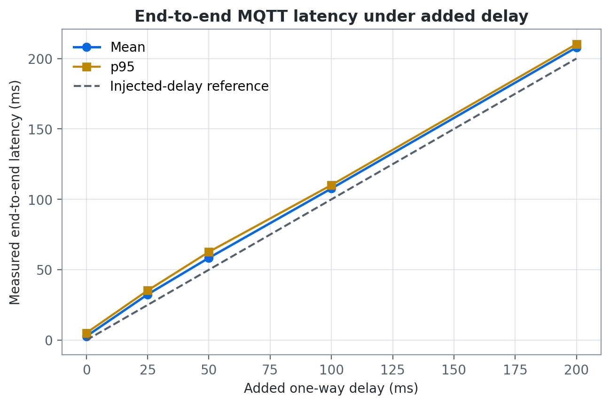

# MQTT network reliability experiment

This experiment measures the telemetry transport path under controlled delay,
message loss, and broker outages. It uses a dedicated Mosquitto container on
port `18883`, so it does not interrupt the normal local stack on port `1883`.

## Research questions

1. How does added one-way delay affect end-to-end MQTT message latency?
2. How does controlled upstream message loss affect delivery rate?
3. How quickly do MQTT clients reconnect, restore their subscription, and
   deliver a new message after the broker returns?

## Reproduce

Docker Desktop and Python 3 are required. The script creates an isolated Python
environment on its first run, starts a temporary broker, runs every condition,
removes the temporary container, and generates the figures.

```bash
./scripts/run-network-experiments.sh
```

Regenerate only the figures from the committed CSV files with:

```bash
./scripts/plot-network-results.sh
```

The committed inputs are
[`latency.csv`](../experiments/results/network/latency.csv),
[`packet-loss.csv`](../experiments/results/network/packet-loss.csv),
[`reconnect.csv`](../experiments/results/network/reconnect.csv), and the
machine-readable [`configuration.json`](../experiments/results/network/configuration.json).
PNG and SVG figures are stored in `experiments/plots/network/`.

## Method

| Factor | Conditions | Repetitions | Messages |
| --- | --- | ---: | ---: |
| Added delay | 0, 25, 50, 100, 200 ms | 3 | 20 per trial |
| Injected loss | 0%, 5%, 10%, 20%, 30%, 40% | 3 | 100 intended per trial |
| Broker outage | 1, 3, 5 seconds | 3 | 1 recovery probe per trial |

All MQTT messages use QoS 1. A fixed random seed makes the loss schedule
repeatable. Delay is inserted before publishing and its duration is included in
the end-to-end measurement. Loss is a seeded application-layer impairment that
drops an intended telemetry message before MQTT publication; it is not an OS
packet-level `netem` test. Broker outages are real: the dedicated Mosquitto
container is stopped and restarted. Reconnection is complete only after both
the publisher is connected and the subscriber's QoS 1 subscription has been
acknowledged.

The observed run used macOS 15.1 on Apple Silicon, Python 3.14.4, Docker Engine
27.5.1, Eclipse Mosquitto 2.0, and Paho MQTT 2.1.0 on 2026-09-20. Exact details
are retained in `configuration.json`.

## Observed results

### Added delay

| Added delay | Mean end-to-end latency | Mean p95 latency | Delivery rate |
| ---: | ---: | ---: | ---: |
| 0 ms | 2.743 ms | 5.121 ms | 100% |
| 25 ms | 32.478 ms | 35.288 ms | 100% |
| 50 ms | 58.432 ms | 62.686 ms | 100% |
| 100 ms | 107.702 ms | 110.157 ms | 100% |
| 200 ms | 207.906 ms | 210.241 ms | 100% |



The measured curve follows the injected delay with approximately 3–8 ms of
local publishing, broker, callback, and scheduling overhead. QoS 1 delivered
all published messages in these local trials.

### Controlled message loss

| Injected loss | Mean delivery rate | Delivery of messages actually published |
| ---: | ---: | ---: |
| 0% | 100.000% | 100% |
| 5% | 94.667% | 100% |
| 10% | 88.000% | 100% |
| 20% | 83.333% | 100% |
| 30% | 67.667% | 100% |
| 40% | 62.000% | 100% |


Variation around the reference line comes from the seeded finite sample of 300
intended messages per condition. Every message that reached the MQTT publisher
was delivered, while the intentionally omitted messages appear as end-to-end
data loss.

### Broker outage and recovery

| Outage | Mean reconnect and resubscribe | Mean first-message recovery | Probes delivered |
| ---: | ---: | ---: | ---: |
| 1 s | 776.262 ms | 817.722 ms | 3/3 |
| 3 s | 793.567 ms | 835.974 ms | 3/3 |
| 5 s | 784.115 ms | 827.460 ms | 3/3 |


Recovery time is measured from the broker restart request, not from the start
of the outage. It remains near 0.8 seconds because the Paho clients use a
one-second reconnect interval. Outage duration determines the data gap, while
the post-restart reconnect policy determines recovery time.

## Limitations

- The loss model operates at the telemetry-message boundary and does not model
  TCP retransmission, congestion, reordering, or correlated wireless loss.
- The broker and clients run on one machine through Docker Desktop; results do
  not represent a cellular or outdoor Wi-Fi deployment.
- Three trials describe repeatability for this portfolio run but are not a
  population-level statistical study.
- QoS 1 can produce duplicates. This experiment records unique message IDs and
  therefore measures successful delivery rather than duplicate count.
- A future study should repeat the experiment with Linux `tc netem`, physical
  edge hardware, energy measurements, and longer outage schedules.
