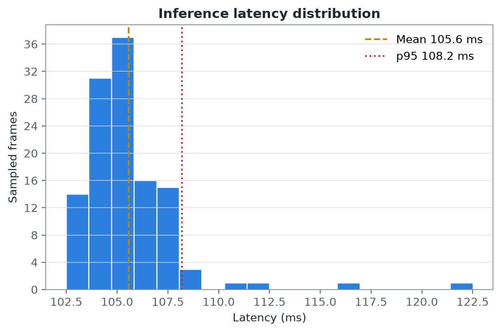
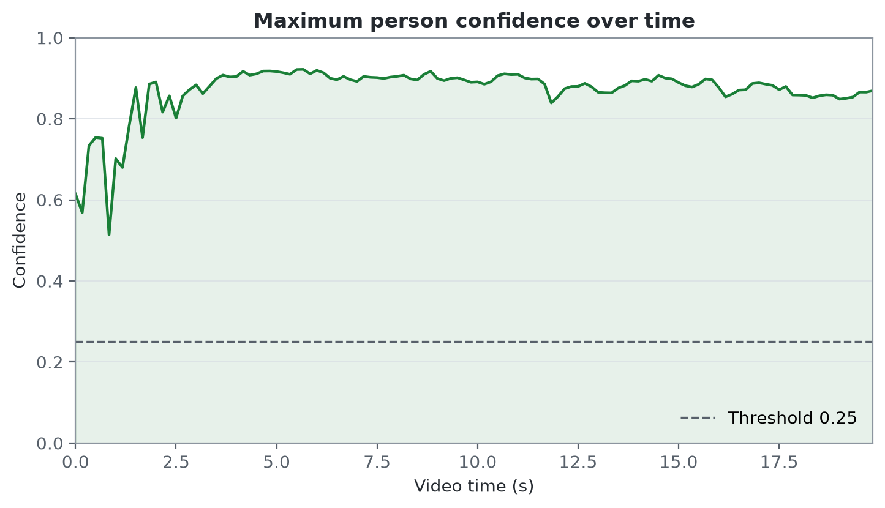

# Fixed-video vision demo

This experiment verifies the smallest hardware-independent visual perception
loop:

```text
20-second hiking video -> sampled YOLO inference -> structured detections
                         -> annotated H.264 video -> latency/FPS summary
```

It demonstrates system integration and performance measurement. It is not an
accuracy evaluation because the stock video has no ground-truth annotations.

## Reproduce

Prepare the local input described in `data/samples/README.md`, then run:

```bash
./scripts/run-vision-demo.sh
./scripts/run-vision-benchmark.sh
./scripts/plot-vision-results.sh
```

The first invocation builds the CPU-only image and downloads `yolo11n.pt` into
the persistent `vision-models` Docker volume. Later runs reuse both artifacts.

## Configuration

| Setting | Value |
| --- | --- |
| Input | `outdoor-hiking-20s.mp4` |
| Source | 1280×720, 30 fps, 600 frames, 20 seconds |
| Model | YOLO11n, COCO pretrained weights |
| Target class | `person` |
| Confidence threshold | 0.25 |
| Inference input size | 640 pixels |
| Frame strides | 1, 2, 5, and 10 |
| Effective sampling rates | 30, 15, 6, and 3 fps |
| Warm-up | 1 unmeasured inference |
| Device | CPU |

## Observed result

The following numbers were generated by the Docker workflow on 2026-09-18,
using an Apple M1 Pro host (10 CPU cores, 16 GB memory) and Docker Engine 27.5.1
for Linux/ARM64.

| Stride | Sampling rate | Mean latency | p95 latency | Pipeline rate | Detection rate* |
| ---: | ---: | ---: | ---: | ---: | ---: |
| 1 | 30 fps | 105.726 ms | 111.703 ms | 8.721 fps | 100% |
| 2 | 15 fps | 108.565 ms | 114.772 ms | 15.781 fps | 100% |
| 5 | 6 fps | 105.570 ms | 108.214 ms | 33.508 fps | 100% |
| 10 | 3 fps | 107.518 ms | 110.870 ms | 51.498 fps | 100% |

\*Detection rate is the share of sampled frames containing at least one
`person` prediction. It is not precision, recall, or mAP.

These are machine- and configuration-specific observations, not general model
claims. The full run configuration is preserved in
`experiments/results/frame-sampling/benchmark.json`; the comparison table is
`summary.csv`, and every run retains its per-frame metrics and detections.

## Visualisations

### Frame-sampling trade-off


The per-inference mean and p95 latency remain broadly stable as sampling rate
changes. Sampling therefore reduces total work rather than making an
individual inference faster. Strides 5 and 10 process the 30 fps source faster
than real time in this batch pipeline; strides 1 and 2 do not.

### Per-frame latency


The stride-5 run is mostly stable near 105 ms, with a small number of visible
outliers. The distribution view makes this tail behaviour explicit.



### Detection confidence



For the stride-5 run, maximum `person` confidence ranged from 0.514 to 0.922,
with a mean of 0.870. These are model confidence scores on one unlabelled clip,
not calibrated probabilities or evidence of accuracy.

## Interpretation

With a stride of five, the system requests six inferences per source-video
second. The observed CPU inference capacity was higher than that demand, and
the whole batch processed faster than the video's 30 fps source rate. Stride 5
is therefore the highest tested sampling frequency that crossed the real-time
source-rate threshold on this machine. This does not establish real-time
edge-device performance or detection accuracy in broader outdoor conditions.
